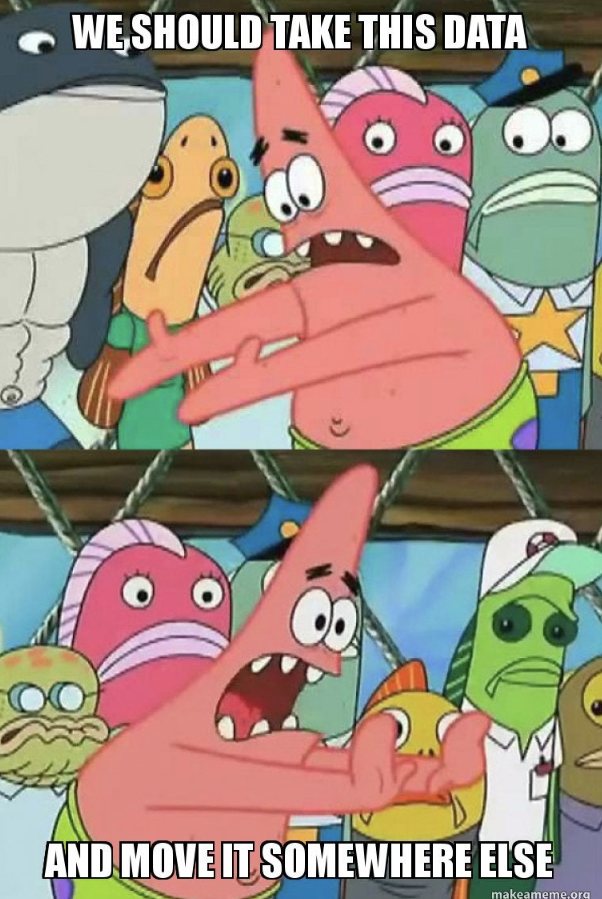

# Journal — 9-20-2025 — DAY 2

## 1) What I learned (bullets, not prose)
- I learned how to encode to clean data
- I learned to create a dimension  and fact table (descriptive)
- I learned how to properly learn joins

## 2) New vocabulary (define in your own words)
- **term** — my definition
- dim - dimension table (descriptive)
- fact- fact table ((numeric, event)

## 3) Data Engineering mindset applied (what principles did I use?)
- No man is an island!

## 4) Decisions & assumptions (why, alternatives, trade-offs)
- For an example exercise, I was tasked to code the visualization for the business question: Which employee generates the most quaterly revenue? I check the attributes of all the table to check if there are relationship to answer the question. 

## 5) Open questions (things I still don’t get)
- huhuhu, what is a data lake?

## 6) Next actions (small, doable steps)
- [ ] practices on the processes: ingestion -> cleaning -> moving to mart

## 7) Artifacts & links (code, queries, dashboards)
- https://dataengineering.ph/

---

### Mini reflection (3–5 sentences)
What surprised me? What would I do differently next time? What will I watch out for in production?

I'm surprised at how cool git is!

### BONUS: What is a meme that best describes what you feel or your learning today?

